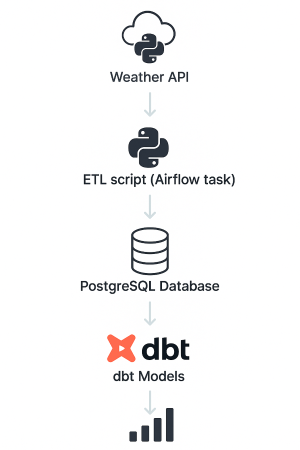
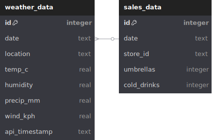

# Weather-Forecast
This project was made for educational purposes about API and data pipelines 

## Technologies Used
- 🐍 Python (ETL logic, API calls, sales simulation)
- 🐘 PostgreSQL (Data warehouse)
- 🐳 Docker (Environment containerization)
- 🌬️ Airflow (ETL orchestration)
- 🧙 dbt (Data transformation and modeling)
- 📊 Matplotlib / Seaborn (Optional for analysis)


---

## 🗃️ Architecture Overview

{ width=300px }

- Weather data is pulled daily from the [WeatherAPI](https://www.weatherapi.com/).
- Sales data is mocked based on temperature and precipitation (e.g., more umbrella sales on rainy days).
- Data is stored in PostgreSQL and processed via dbt to compute aggregates.
- Airflow schedules and monitors the entire pipeline.

---

## ER Diagram



## 🔄 Airflow DAG

The ETL is orchestrated using Apache Airflow, running as a containerized service via Docker.

- Tasks: Pull weather → Generate sales → Insert to DB → Trigger dbt
- Schedule: 30 minutes


---

## dbt Models

dbt transforms raw data into analytics-ready tables.

- `stg_weather`: Raw weather table
- `daily_avg_weather`: Aggregated weather metrics by day and location

```text
               ┌───────────────────────────┐
               │  source.weather_data      │
               │  (raw PostgreSQL source)  │
               └────────────┬──────────────┘
                            │
                            ▼
                ┌────────────────────┐
                │    stg_weather     │
                │  (staging model)   │
                └──────┬─────────────┘
                       │
        ┌──────────────┴──────────────┐
        ▼                             ▼
┌────────────────────┐     ┌─────────────────────┐
│   daily_average    │     │   weather_report    │
│ (mart: aggregates) │     │ (mart: full report) │
└────────────────────┘     └─────────────────────┘
```
---


## Sample analysis
